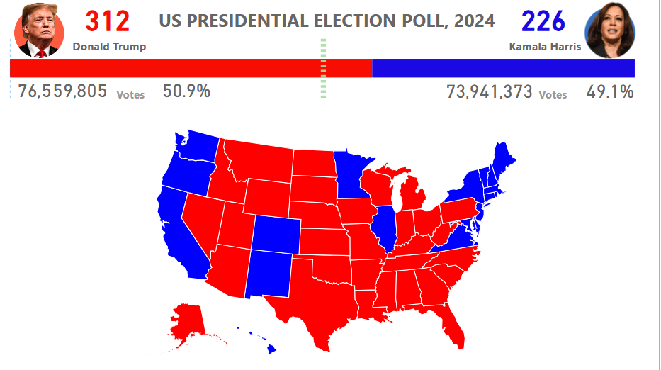

# Some of my Projects
# [📊 Bank Loan Analysis Project](https://zhanyzhaks.github.io/Bank-Loan-Analysis/)
## 🧾 Executive Summary
The bank loan analysis project explores trends in 38.6K loan applications worth over $435.8 million. It distinguishes between good and bad loans, examines repayment patterns, and identifies high-risk categories based on demographics and employment data. The findings help inform policy changes and risk mitigation strategies.

## 📌 Key Insights
### 📉 Summary Dashboard
Good Loans: 86.2% (33.2K applications)

Bad Loans: 13.8% (5.3K applications)

Fully Paid Loans: 93.7%

Charged Off Loans: 6.3%

Employment History: Applicants with 10+ years had the most applications

Performance: Good loans had the highest issuance and repayment value

# [US Presidential Election Poll, 2024](https://github.com/zhanyzhaks/us-election-poll-2024/)

## 📊 Project Overview
This project presents an analysis and visualization of a hypothetical 2024 US Presidential Election Poll between Donald Trump and Kamala Harris. The results were visualized to show the number of electoral votes and the popular vote per candidate, along with a color-coded map of the US indicating which states voted for each candidate.

## 🧾 Project Objectives
Analyze poll data for the 2024 US Presidential Election.

Visualize electoral and popular vote distributions.

Present results with an interactive US map visualization.

Identify voting patterns and regional support.

## 📌 Key Results
| Candidate      | Electoral Votes | Popular Votes      | Percentage |
|----------------|-----------------|--------------------|------------|
| Donald Trump   | 312             | 76,559,805         | 50.9%      |
| Kamala Harris  | 226             | 73,941,373         | 49.1%      |

**Winner:** Donald Trump (Electoral College Majority)

**Margin:** Trump leads with 1.8% in popular vote

## 🗺️ Visualization

